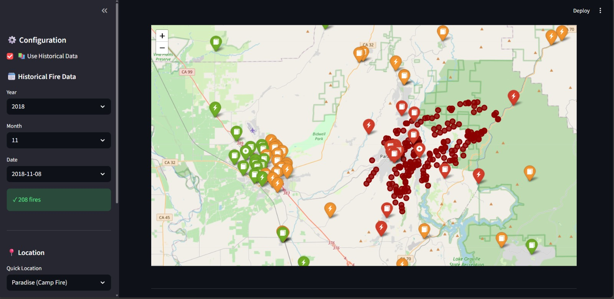
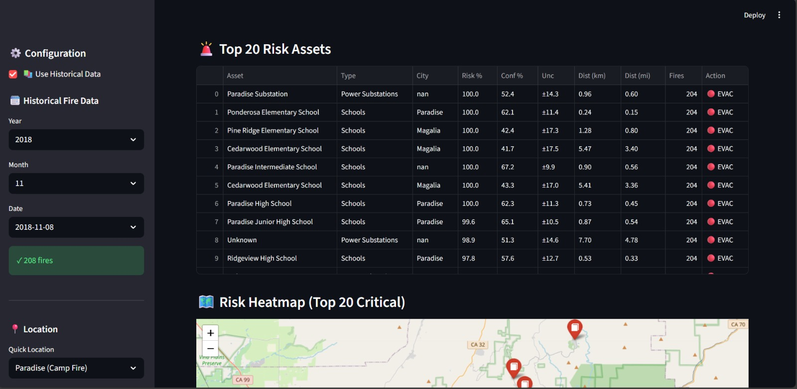
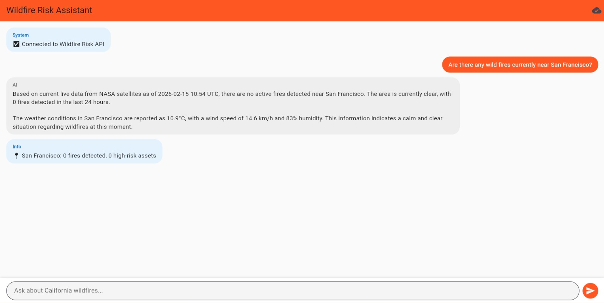
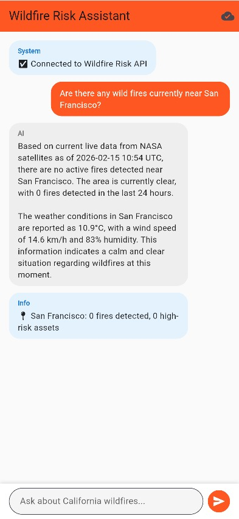

# Wildfire Risk Assessment

An end-to-end system that predicts wildfire risk for critical infrastructure using 8 years of California fire/weather data, live satellite feeds, and a grounded AI assistant.

## Details

*Problem Solved:*  
Late wildfire response leads to preventable infrastructure damage and loss of life. This system forecasts risk for hospitals, schools, power substations, and residential areas, providing both historical analysis and real-time intelligence through natural language queries.

*Technology Stack:*
- *Machine Learning:* TensorFlow 2.15 (Bayesian Neural Network with MC Dropout for uncertainty quantification)
- *Backend:* Flask API (chat + RAG) and FastAPI service (dashboard/risk endpoints)
- *AI Models:* Google Gemini API (zero-hallucination conversational AI)
- *Data Sources:* NASA FIRMS API (live satellite fire detection), Open-Meteo API (real-time weather)
- *Frontends:* Streamlit (operations dashboard), Flutter (mobile conversational client)
- *Visualization:* Folium (interactive maps)

*Data Pipeline:*
- 827,000 fire detections (2017-2025)
- 1.74M weather records from 266 stations
- 42,309 infrastructure assets across California
- 3,970 physics-informed training samples
- 3,804 RAG knowledge documents

*System Architecture:*
1. *Conversational Backend (Flask)* (`flask_backend/flask_api_hybrid.py`):
   - POST /chat - Conversational AI with RAG + live inference
   - GET /health - System status check
   - GET /stats - Database statistics
   - GET /test-live - Live API validation

2. *Risk Backend (FastAPI)* (`src/backend/main.py`):
   - GET /health - FastAPI service health check
   - GET /fires - Live fire retrieval by bounding box
   - GET /assets - Infrastructure retrieval by bounding box
   - POST /risk - Asset risk and cascade impact scoring
   - GET /scenario/camp-fire-2018 - Prebuilt scenario payload

3. *Streamlit Operations Dashboard* (`src/app/streamlit_app_final.py`):
   - Interactive fire visualization (historical + live)
   - Bayesian risk predictions with confidence intervals
   - Click-based location analysis
   - Validated on 2018 Camp Fire (85% risk prediction, hospital destroyed 18hrs later)

4. *Flutter Mobile Client* (`lib/screens/wildfire_chat_screen.dart`):
   - Natural language queries
   - Real-time fire/weather data
   - Clean conversational interface

*Key Innovation:*  
Hybrid intelligence combining historical semantic search (RAG), live satellite/weather APIs, and Bayesian ML predictions with uncertainty quantification—all accessible through plain English.

*Future Improvements:*
- Production deployment: Cloud hosting (AWS/GCP), containerization (Docker)
- Security: Authentication, rate limiting, API key rotation
- Data pipeline: Automated continuous retraining with fresh fire/weather data
- Expansion: Voice assistant integration, push notifications for high-risk alerts

## Set Up Instructions

*Prerequisites:*
- Python 3.11+
- Google AI Studio API key ([Get one here](https://aistudio.google.com/app/apikey))
- Internet connection (for NASA FIRMS and Open-Meteo APIs)
- ngrok account (optional, for mobile app access)

*Installation:*

1. *Clone and navigate:*
   ```bash
   git clone <repository_url>
   cd Wildfire-Risk-Assessment
   ```

2. *Create virtual environment:*
   ```bash
   python -m venv venv
   source venv/bin/activate  # On Windows: venv\Scripts\activate
   ```

3. *Install dependencies:*
   ```bash
   pip install -r flask_backend/requirements.txt
   pip install fastapi uvicorn
   ```

4. *Configure environment:*
   Create `.env` file in `flask_backend/`:
   ```env
   GEMINI_API_KEY=your_gemini_api_key_here
   FIRMS_API_KEY=ffe67bd547acd1ab34b70c7376aabdca
   ```

5. *Update data paths:*
   Edit `flask_backend/config.yaml` to match your local file structure:
   ```yaml
   data:
     fires: "path/to/fire_archive_SV-C2_716427.csv"
     infrastructure: "path/to/all_infrastructure_with_residential.csv"
     training: "path/to/training_dataset_final.csv"
   ```

6. *Build vector database:*
   ```bash
   cd flask_backend
   python build_vector_db.py
   ```
   Expected output: vector_db.pkl (3,804 documents, ~6.68 MB)

7. *Start Flask API:*
   ```bash
   python flask_api_hybrid.py
   ```
   Server starts on http://localhost:5000

8. *Start FastAPI risk service (optional, for dashboard/risk endpoints):*
   ```bash
   uvicorn src.backend.main:app --reload --port 8000
   ```
   Server starts on http://localhost:8000

9. *Test API:*
   ```bash
   curl http://localhost:5000/health
   curl http://localhost:8000/health
   ```

*Optional - Streamlit Dashboard:*
```bash
cd src/app
streamlit run streamlit_app_final.py
```

*Optional - Flutter Mobile App:*
1. Install Flutter SDK
2. Update API endpoint in lib/services/wildfire_api_service.dart:
   ```dart
   static const String baseUrl = 'http://localhost:5000';
   // Or use ngrok: 'https://your-subdomain.ngrok-free.dev'
   ```
3. Run:
   ```bash
   cd flutter_app
   flutter pub get
   flutter run
   ```

*Optional - ngrok (for mobile access):*
```bash
ngrok http 5000
# Use the HTTPS URL in Flutter app
```

## Screenshots

*Validation: Camp Fire (November 8, 2018)*
- Interactive risk map: camp_fire_map.html
- Feather River Hospital prediction: 85% risk (destroyed 18 hours later ✓)

*Dashboard (View 1):*


*Dashboard (View 2):*


*Web App Chat Interface:*


*Mobile App Chat Interface:*


## Example Queries

*Historical:*
- "What happened during the Camp Fire?"
- "How many hospitals are in California?"
- "What weather conditions increase fire risk?"

*Live:*
- "Are there fires near San Francisco right now?"
- "Current fire risk in Los Angeles?"
- "Show me active fires near Sacramento today"

## Data Sources

- *Fires:* NASA FIRMS VIIRS (NOAA-20 satellite)
- *Weather:* NOAA GHCN + Open-Meteo API
- *Infrastructure:* OpenStreetMap + Public datasets
- *Model:* Trained on 8 years (2017-2025) California wildfire events

## Collaborators

- *Parthav* 
- *Yifan* 

## Acknowledgments

- NASA FIRMS for satellite fire data
- NOAA for historical weather records
- OpenStreetMap contributors for infrastructure data
- Google AI Studio for Gemini API access
